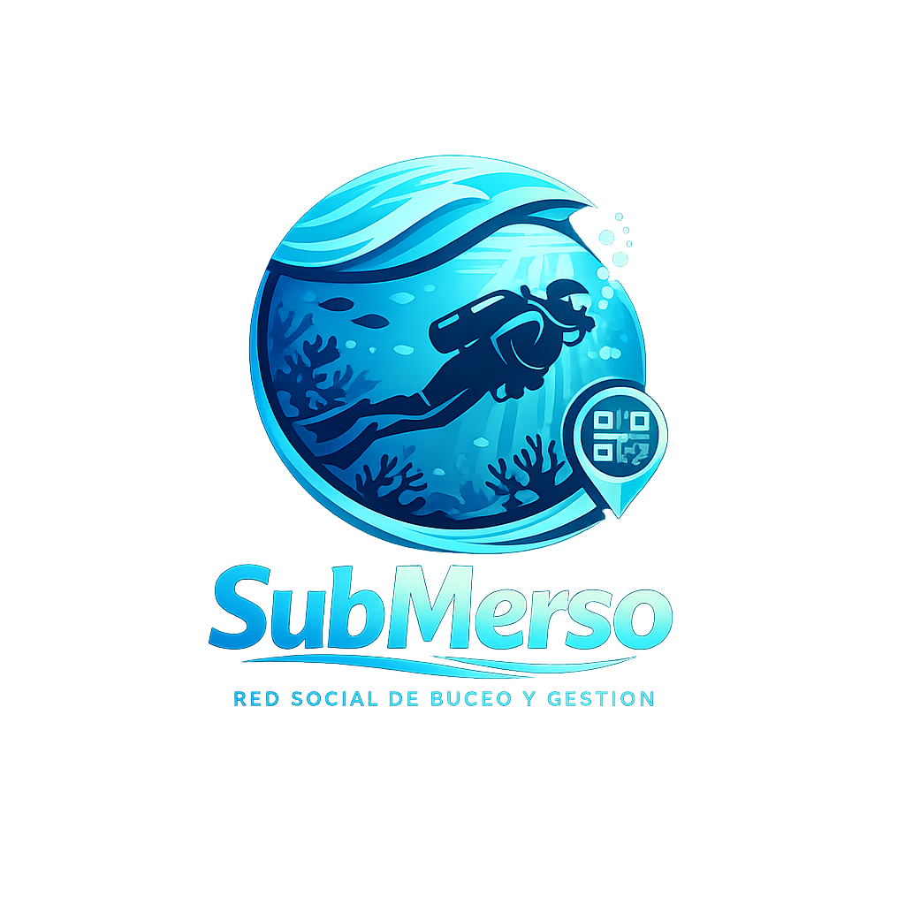

# SubMerso

  

## Integrantes del Equipo

- Marcos Montes
- Sergio Cayetano
- Carmen Merino

## Descripción

SubMerso es una aplicación web full-stack diseñada como una red social vertical que digitaliza y unifica la experiencia del buceo. La plataforma permite a los usuarios conectar entre sí compartiendo sus experiencias, fotos y logros mediante un feed interactivo.

A diferencia de las redes generalistas, SubMerso integra un ecosistema de validación y servicios: conecta la parte social con un motor de reservas Marketplace y un Logbook digital verificado. Así, cuando un usuario reserva y realiza una inmersión, esta se valida mediante QR en el centro de buceo y se publica automáticamente en su perfil social como una experiencia certificada, aportando veracidad y valor a la comunidad.

## Objetivos y Funcionalidades Principales

### 1. Red Social de Nicho (Social Diver)
Creación de perfiles públicos con estadísticas, muro de actividad  para compartir inmersiones y fotos, y sistema de seguidores y seguidos  con interacciones ,likes y comentarios.

### 2. Gestión de Reservas (Marketplace)
Buscador geolocalizado para reservar viajes y cursos en centros de buceo, con gestión de disponibilidad y pagos integrados.

### 3. Logbook Digital 2.0 y Validación
Registro técnico de inmersiones (profundidad, tiempo, equipo) que, tras ser validado por el centro mediante código QR, otorga insignias de "Verificado" en el perfil social del usuario.

### 4. Asistente Inteligente (DeepBlue Bot)
Integración de IA para recomendar viajes, compañeros de buceo o equipos basándose en el historial y preferencias sociales del usuario.

## Arquitectura y Stack Tecnológico

Para el desarrollo de esta arquitectura desacoplada (SPA), se emplea el siguiente stack tecnológico:

### Cliente (Frontend)
- **Angular** con **TypeScript** para la estructura modular y la reactividad de la interfaz social
- **Tailwind CSS** combinado con **Bootstrap** para el diseño y maquetación responsiva

### Servidor (Backend)
- **Java** (versión 17/21) con el framework **Spring Boot**
- **Spring Security** para seguridad robusta
- Autenticación basada en tokens **JWT**

### Base de Datos (Persistencia)
- **MongoDB** 
  - Elegido por su flexibilidad para almacenar estructuras de datos variables (perfiles sociales, comentarios, feeds y registros de buceo)
  - Alta velocidad de lectura
  - Soporte para transacciones ACID en versiones actuales, manteniendo la seguridad en pagos

### Librerías y APIs Externas
- **Stripe API**: Para la pasarela de pagos segura
- **Mapbox GL**: Para la visualización de mapas interactivos y geolocalización de inmersiones
- **OpenAI API / Gemini**: Para el motor del asistente virtual

